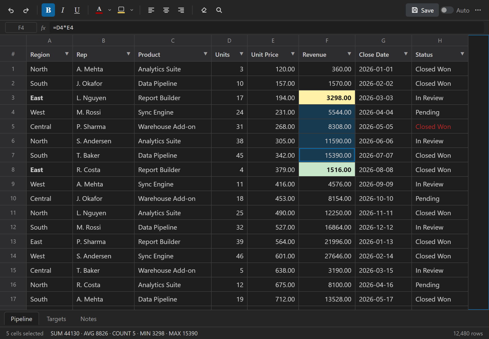
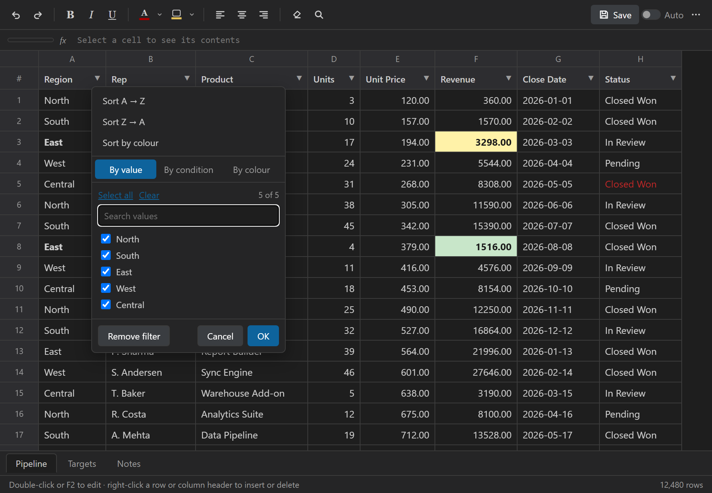
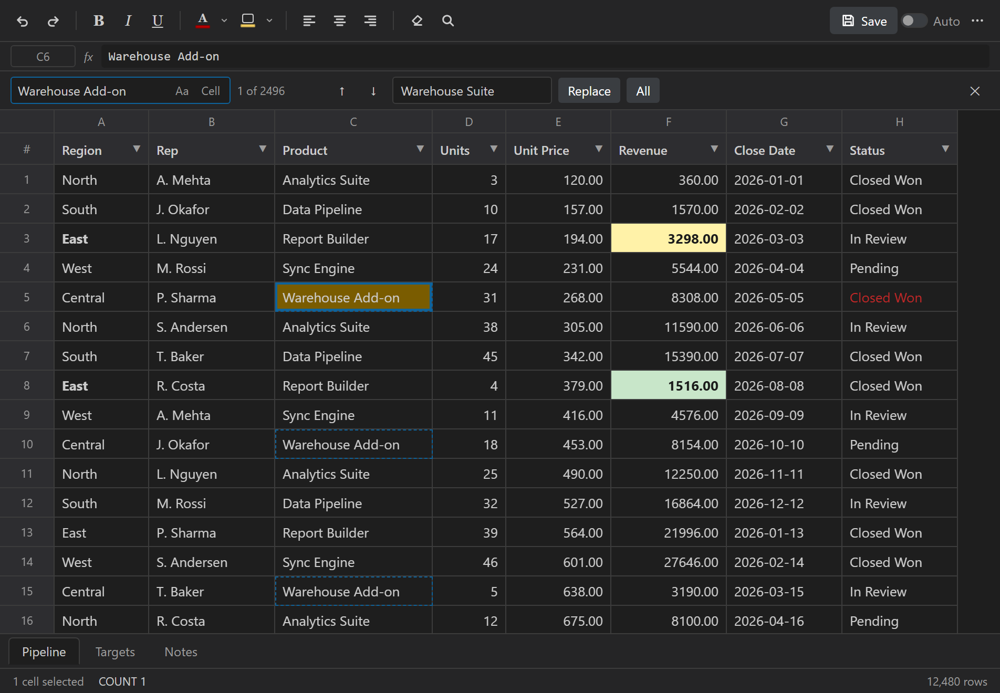
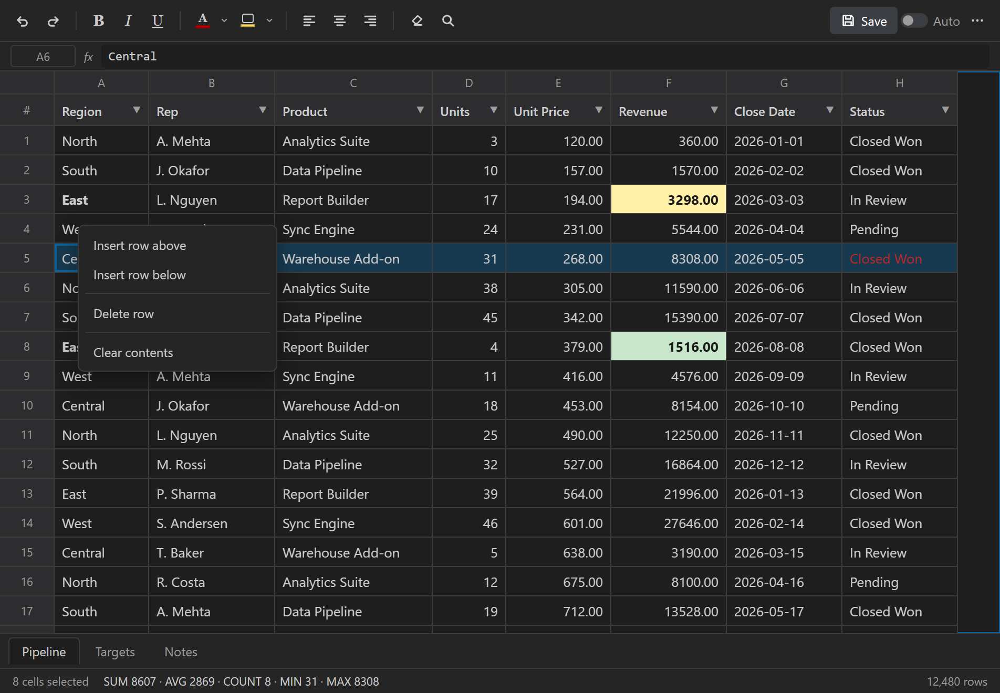
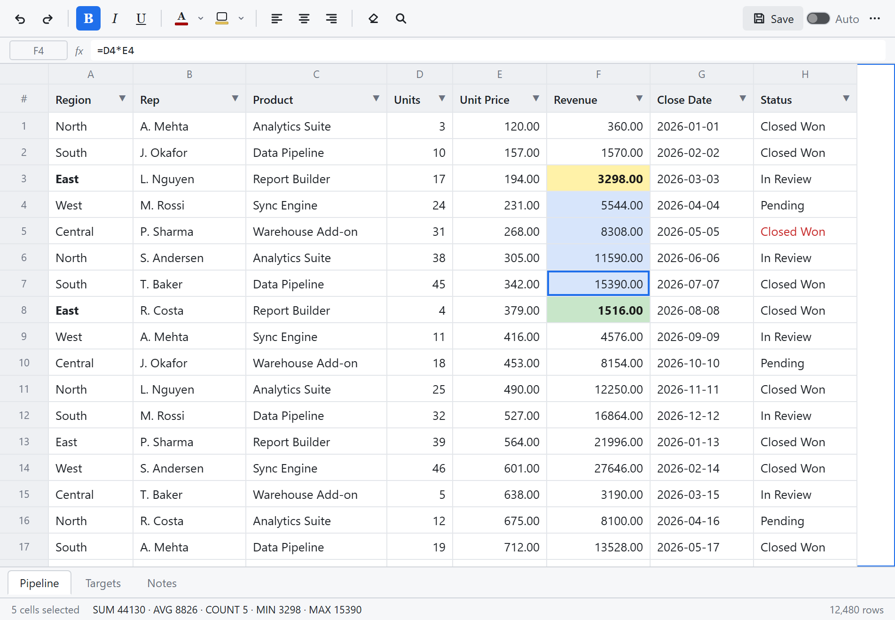

# Excel Lite

**Open, read and edit Excel and CSV files without leaving VS Code — and without
quietly rewriting the parts of your workbook you never touched.**

[](https://marketplace.visualstudio.com/items?itemName=rahulraghunathb.excel-lite)
[](https://marketplace.visualstudio.com/items?itemName=rahulraghunathb.excel-lite)
[](https://marketplace.visualstudio.com/items?itemName=rahulraghunathb.excel-lite&ssr=false#review-details)



---

## Why Excel Lite

Most spreadsheet viewers rebuild the file when they save it. Anything they don't
model — other worksheets, formulas, merged cells, charts, number formats — is
gone the moment you edit one cell.

Excel Lite **patches the original file instead of rebuilding it**. It tracks
exactly which cells you changed and writes back only those, so everything else
survives byte for byte:

- other worksheets, formulas, merged cells, frozen panes;
- number formats, column widths, borders, conditional formatting, charts, images.

CSV files keep their delimiter, line endings, BOM and blank lines, so editing one
cell shows up in `git diff` as one changed line — not the whole file.

---

## Features

### Read any sheet, fast

The grid is virtualised: only the rows on screen exist in the DOM, and the
extension streams a window of rows at a time. Files with hundreds of thousands of
rows open instantly and scroll smoothly.

- `.xlsx`, `.xlsm`, `.csv` and `.tsv`, with tabs for multi-sheet workbooks.
- Values keep their type — numbers stay numeric, dates render as `YYYY-MM-DD`,
  and formulas show their result rather than `[object Object]`.
- Status bar shows **SUM, AVG, MIN, MAX and COUNT** for the selection.

### Sort and filter like a spreadsheet



- Click a header to cycle ascending → descending → unsorted.
- Filter **by value** (searchable checklist of every distinct value),
  **by condition** (contains, starts with, is empty, `>`, `<`, between, and their
  negations) or **by fill colour**.
- Sorting is type-aware: numbers sort numerically, dates chronologically, and
  blanks always sort last.

### Find and replace



`Ctrl+F` opens find and replace, with match-case, whole-cell matching, `F3` to
step through hits, and replace-all as a **single undo step**.

Matching runs against the text the cell editor shows, so a formula matches on its
expression rather than its cached result — and a replacement round-trips back
into a formula instead of freezing it to a value.

### Edit with real spreadsheet ergonomics



- **Insert and delete rows and columns** from the right-click menu on a row
  number or column header.
- A **formula bar** shows the selected cell's reference and true contents.
- Full keyboard navigation: arrows, `Tab`, `Enter`, `Page Up/Down`, `Home`/`End`,
  `Ctrl+A`, `Delete` to clear, or just start typing to replace a cell.
- Copy, cut and paste interoperate with Excel and Google Sheets, including
  multi-line quoted cells. Pasting past the last row grows the sheet.
- Bold, italic, underline, text colour, fill colour and alignment — all
  round-tripping into the file.

### Saves you can trust

- The tab shows a **dirty indicator**; `Ctrl+S` saves; closing with unsaved
  changes prompts you, and unsaved work survives a restart.
- `Ctrl+Z` / `Ctrl+Y` use VS Code's own undo stack.
- If the file changed on disk since you opened it, saving **asks before
  overwriting**. A clean file that changes on disk reloads automatically.
- Optional **Auto Save**.

### Follows your theme



The grid inherits your VS Code theme by default, with an explicit light/dark
override available from the toolbar's ⋯ menu.

---

## Keyboard shortcuts

| Shortcut | Action |
| --- | --- |
| `F2` / `Enter` / any character | Edit the selected cell |
| `Arrows`, `Tab`, `Page Up/Down`, `Home`/`End` | Move the cursor |
| `Shift` + movement | Extend the selection |
| `Ctrl`/`Cmd` + click | Add a separate range to the selection |
| `Ctrl+A` | Select all |
| `Ctrl+C` / `Ctrl+X` / `Ctrl+V` | Copy / cut / paste |
| `Delete` / `Backspace` | Clear the selected cells |
| `Ctrl+F` | Find and replace |
| `F3` / `Shift+F3` | Next / previous match |
| `Ctrl+Z` / `Ctrl+Y` | Undo / redo |
| `Ctrl+S` | Save |
| `Escape` | Close the find panel, or clear the selection |

---

## Getting started

1. Open any `.xlsx`, `.xlsm`, `.csv` or `.tsv` file — Excel Lite is the default
   editor for those types.
2. Edit, format, sort and filter, then `Ctrl+S`.

To open a file as raw text instead, right-click it and choose
**Open With… → Text Editor**.

---

## Known limitations

- **Legacy `.xls`** (the pre-2007 binary format) is not supported. Open it in
  Excel or LibreOffice and re-save as `.xlsx`.
- Formulas are preserved but **not recalculated** — editing a cell does not
  update formulas that depend on it until the file is reopened in Excel.
- Row and column insert/delete are unavailable while a sort or filter is active,
  because view order and sheet order would disagree about which row is which.
  Clear them first.
- Adding, deleting or reordering worksheets is not yet supported (renaming is).

---

## Release notes

See [CHANGELOG.md](CHANGELOG.md) for the full history.

## Author

**Rahul Raghunath Bodanki**

- [GitHub](https://github.com/rahulraghunathb)
- [Portfolio](https://portfolio-website-beta-two-82.vercel.app/)

Issues and feature requests are welcome on the
[issue tracker](https://github.com/rahulraghunathb/excel-lite-vscode-extension/issues).

## Development

```bash
npm install
npm run watch   # rebuilds the extension and webview bundles
npm test        # 153 unit, round-trip and end-to-end tests
```

Press `F5` in VS Code to launch the Extension Development Host.
See [BUILD.md](BUILD.md) for architecture and packaging notes.

## License

[Apache-2.0](LICENSE)
